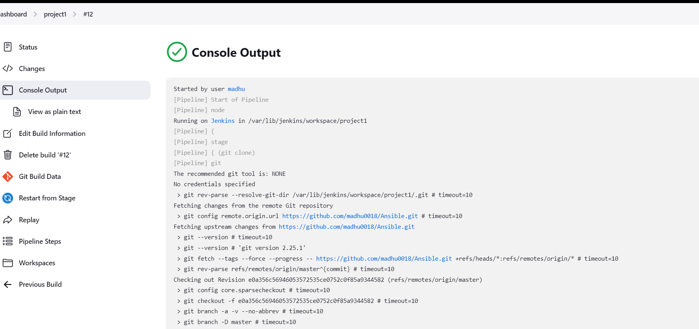

# this is the documentatio
-----------------------
* create VM and install ansible .
```
$ sudo apt update
$ sudo apt install software-properties-common
$ sudo add-apt-repository --yes --update ppa:ansible/ansible
$ sudo apt install ansible

```

*  write playbook for apache2.
  ```yaml
   ---
- name: apache
  hosts: localhost
  become: yes
  tasks: 
    - name: apache install
      ansible.builtin.apt:
        name: apache2
        update_cache: yes
        state: present

```
* in vm install java11 and jenkins

```
sudo apt install openjdk-11-jdk -y
sudo apt install maven -y
curl -fsSL https://pkg.jenkins.io/debian-stable/jenkins.io.key | sudo tee \
  /usr/share/keyrings/jenkins-keyring.asc > /dev/null
echo deb [signed-by=/usr/share/keyrings/jenkins-keyring.asc] \
  https://pkg.jenkins.io/debian-stable binary/ | sudo tee \
  /etc/apt/sources.list.d/jenkins.list > /dev/null
sudo apt-get update
sudo apt-get install jenkins -y
```
## write jenkinsfile for Ansible Playbook .

```
pipeline {
    agent any
    stages{
        stage ('git clone'){
            steps {
                git url: "https://github.com/madhu0018/Ansible.git" ,
                branch : "master"
            }
        }
        stage('installing appache2'){
            steps {
                sh 'ansible-playbook playbook.yaml'
            }
        }
    }
}
```
# Build the project and run the program .


